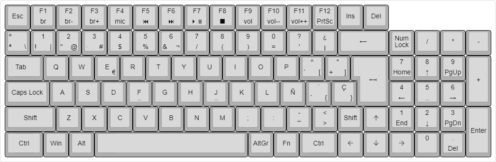

# RCK

### Introduction
----
**Reinosa Custom Keyboard (RCK)** is an open source project dedicated to creating a complete guide on how to create your own custom keyboard from scratch.

In the following sections, we will discuss the step-by-step, hardware/software recommendations and the methodology used for the success of this project.

### Layout design (optional)
----
The first step in creating your own custom mechanical keyboard is whether you want to use an existing keyboard layout (which will make it easier to find the necessary parts) or whether you want to customise the keyboard layout entirely.

In this project, the decision has been made to custom design the layout. The layout is a personal decision and I invite you to spend a lot of time designing the keyboard that best suits you.

In this case, we have used the online tool http://www.keyboard-layout-editor.com/#/ which will allow us to get a first idea of the design of our layout. There are different tools to fulfil this function such as Adobe Illustrator or CorelDRAW.

The end result of our first approximation of the final design will be this:

In the layout folder, you will find the *.json* used for the design of this layout.

### Version control and release
----
Version 1.0
Under development.